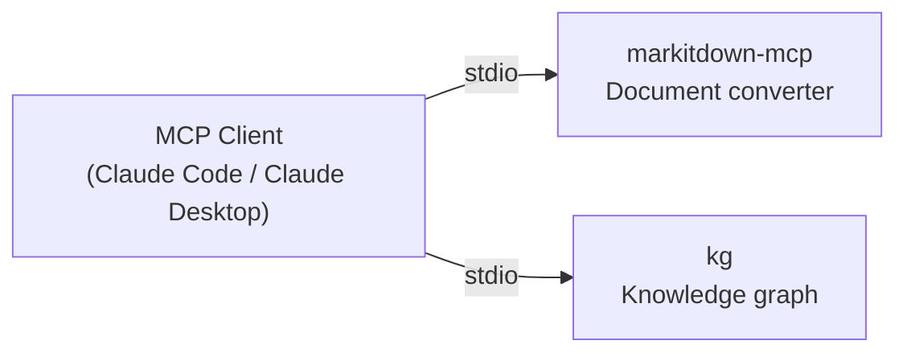

# MCP Servers

A collection of standalone [Model Context Protocol](https://modelcontextprotocol.io)
servers written in Go. Each server is independently buildable and installable — pick
only what you need. Released under the [MIT No Attribution License](LICENSE.md).

## Available Servers

| Server | Description | CGO |
|--------|-------------|-----|
| [markitdown](src/markitdown/) | Convert documents to Markdown (HTML, PDF, DOCX, XLSX, PPTX, images) | No |
| [kg](src/kg/) | Project knowledge graph — store and query code entities across sessions. Supports multi-scope graphs for monorepos. | Yes |



Each server is a self-contained Go binary with its own `go.mod`. No server depends on
another.

## Quick Install

```bash
# Install all servers
curl -fsSL https://raw.githubusercontent.com/Cortexa-LLC/mcp/main/install.py | python3

# Install a specific server
curl -fsSL https://raw.githubusercontent.com/Cortexa-LLC/mcp/main/install.py | python3 - --mcp kg
curl -fsSL https://raw.githubusercontent.com/Cortexa-LLC/mcp/main/install.py | python3 - --mcp markitdown

# From a clone
python3 install.py --mcp kg
python3 install.py --mcp markitdown
python3 install.py              # installs all
```

**Install dir defaults** (override with `--prefix DIR` or `INSTALL_DIR=...`):

| Platform | Default |
|----------|---------|
| macOS | `/usr/local/bin` |
| Linux | `/usr/local/bin` (may need `sudo`) |
| Windows | `%LOCALAPPDATA%\Programs\mcp` |

## Manual Build (per server)

```bash
cd src/markitdown && make install
cd src/kg         && make install          # requires a C compiler (CGO)
```

## Prerequisites

- **Go 1.24+** — [install](https://go.dev/dl/)
- **kg only**: C compiler — Xcode CLT on macOS (`xcode-select --install`), gcc/clang on Linux
- **markitdown OCR** *(optional)*: Tesseract 5+ (`brew install tesseract`)

## MCP Configuration

After installing, add the servers to your MCP client:

### Claude Desktop

```json
{
  "mcpServers": {
    "markitdown": {
      "command": "/usr/local/bin/markitdown-mcp"
    },
    "kg": {
      "command": "/usr/local/bin/kg",
      "args": ["server", "--stdio"]
    }
  }
}
```

Config file locations:
- **macOS**: `~/Library/Application Support/Claude/claude_desktop_config.json`
- **Linux**: `~/.config/Claude/claude_desktop_config.json`
- **Windows**: `%APPDATA%\Claude\claude_desktop_config.json`

### Claude Code (`.mcp.json` in project root)

**Recommended for `kg`** — place `.mcp.json` in each project root so Claude Code
spawns `kg` with the correct working directory, ensuring it opens that project's
`.ai/knowledge.db` and not another project's graph.

```json
{
  "mcpServers": {
    "markitdown": { "command": "/usr/local/bin/markitdown-mcp" },
    "kg":         { "command": "/usr/local/bin/kg", "args": ["server", "--stdio"] }
  }
}
```

`markitdown` is stateless and can be configured globally in `~/.claude/settings.json`
if preferred.

## Server Details

- **[markitdown](src/markitdown/README.md)** — No CGO, no system dependencies for core formats.
  OCR for images requires Tesseract (optional, degrades gracefully).
  → [Integration guide](docs/markitdown-claude-integration.md)

- **[kg](src/kg/README.md)** — Requires CGO (bundles KuzuDB statically). Each project gets
  its own isolated graph at `.ai/knowledge.db`, auto-discovered by walking up the directory
  tree. Supports OpenAI or Ollama embeddings for semantic search (optional).
  → [CLI reference](docs/kg-cli-reference.md) · [Integration guide & CLAUDE.md patterns](docs/kg-claude-integration.md)

## Docs

| Document | Description |
|----------|-------------|
| [docs/kg-cli-reference.md](docs/kg-cli-reference.md) | Full kg CLI reference — all commands, flags, entity types, Cypher examples |
| [docs/kg-claude-integration.md](docs/kg-claude-integration.md) | KG patterns for CLAUDE.md, reducing re-investigation, decision logging, cross-session checkpointing |
| [docs/markitdown-claude-integration.md](docs/markitdown-claude-integration.md) | Reading PDFs, DOCX, spreadsheets, and URLs; combining with the KG |
