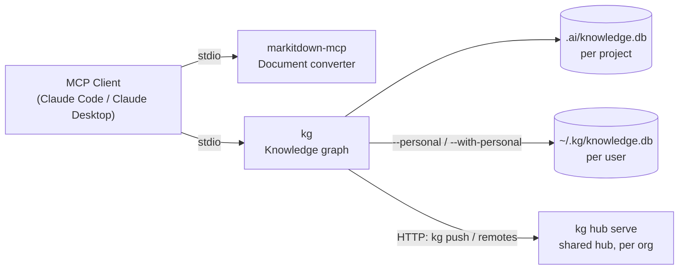

# MCP Servers

A collection of standalone [Model Context Protocol](https://modelcontextprotocol.io)
servers written in Go. Each server is independently buildable and installable — pick
only what you need. Released under the [MIT No Attribution License](LICENSE.md).

## Available Servers

| Server | Description | CGO |
|--------|-------------|-----|
| [markitdown](src/markitdown/) | Convert documents to Markdown (HTML, PDF, DOCX, XLSX, PPTX, images) | No |
| [kg](src/kg/) | Project knowledge graph — store and query code entities across sessions. Supports multi-scope graphs for monorepos, federated across layers, plus a personal store. Renders as mermaid or Graphviz diagrams with `kg graph`. Graphs can also be pushed to a shared hub (`kg hub serve`) and searched from other projects as remote layers. | Yes |

Plus one shared library, not installed as a binary:

| Library | Description |
|---------|-------------|
| [kglib](src/kglib/) | KuzuDB schema, entity/relation/observation CRUD, hybrid search, embedders, and the `FederatedStore` that merges results across multiple KG databases |


```mermaid
graph LR
    Client["MCP Client\n(Claude Code / Claude Desktop)"]
    MD["markitdown-mcp\nDocument converter"]
    KG["kg\nKnowledge graph"]
    KGDB[(".ai/knowledge.db\nper project")]
    PERSONAL[("~/.kg/knowledge.db\nper user")]
    HUB["kg hub serve\nshared hub, per org"]

    Client -->|stdio| MD
    Client -->|stdio| KG
    KG --> KGDB
    KG -->|"--personal / --with-personal"| PERSONAL
    KG -->|"HTTP: kg push / remotes"| HUB
```

Each server is a self-contained Go binary with its own `go.mod`. No server depends on
another; `kg` uses the `kglib` library via a local `replace` directive.

## Quick Install

```bash
# Install all servers
curl -fsSL https://raw.githubusercontent.com/Cortexa-LLC/mcp/main/install.py | python3

# Install a specific server
curl -fsSL https://raw.githubusercontent.com/Cortexa-LLC/mcp/main/install.py | python3 - --mcp kg
curl -fsSL https://raw.githubusercontent.com/Cortexa-LLC/mcp/main/install.py | python3 - --mcp markitdown

# From a clone
python3 install.py --mcp kg
python3 install.py --mcp markitdown
python3 install.py              # installs all
```

**Install dir defaults** (override with `--prefix DIR` or `INSTALL_DIR=...`):

| Platform | Default |
|----------|---------|
| macOS | `/usr/local/bin` |
| Linux | `/usr/local/bin` (may need `sudo`) |
| Windows | `%LOCALAPPDATA%\Programs\mcp` |

## Manual Build (per server)

```bash
cd src/markitdown && make install
cd src/kg         && make install          # requires a C compiler (CGO)

make install                               # from the repo root: both servers
make test                                  # kglib + all servers
```

## Prerequisites

- **Go 1.24+** — [install](https://go.dev/dl/)
- **kg only**: C compiler — Xcode CLT on macOS (`xcode-select --install`), gcc/clang on Linux
- **markitdown OCR** *(optional)*: Tesseract 5+ (`brew install tesseract`)

## MCP Configuration

After installing, add the servers to your MCP client:

### Claude Desktop

```json
{
  "mcpServers": {
    "markitdown": {
      "command": "/usr/local/bin/markitdown-mcp"
    },
    "kg": {
      "command": "/usr/local/bin/kg",
      "args": ["server", "--stdio"]
    }
  }
}
```

Config file locations:
- **macOS**: `~/Library/Application Support/Claude/claude_desktop_config.json`
- **Linux**: `~/.config/Claude/claude_desktop_config.json`
- **Windows**: `%APPDATA%\Claude\claude_desktop_config.json`

### Claude Code (`.mcp.json` in project root)

**Recommended for `kg`** — place `.mcp.json` in each project root so Claude Code
spawns `kg` with the correct working directory, ensuring it opens that project's
`.ai/knowledge.db` and not another project's graph.

```json
{
  "mcpServers": {
    "markitdown": { "command": "/usr/local/bin/markitdown-mcp" },
    "kg":         { "command": "/usr/local/bin/kg", "args": ["server", "--stdio"] }
  }
}
```

`markitdown` is stateless and can be configured globally in `~/.claude/settings.json`
if preferred.

## Server Details

- **[markitdown](src/markitdown/README.md)** — No CGO, no system dependencies for core formats.
  OCR for images requires Tesseract (optional, degrades gracefully).
  → [Integration guide](docs/markitdown-claude-integration.md)

- **[kg](src/kg/README.md)** — Requires CGO (bundles KuzuDB statically). Each project gets
  its own isolated graph at `.ai/knowledge.db`, auto-discovered by walking up the directory
  tree. Monorepos can split the graph into scopes that federate across layers. Supports
  OpenAI or Ollama embeddings for semantic search (optional).
  Also keeps a personal store (`kg personal init`) for knowledge that follows you
  between repositories, searchable alongside a project's graph with `--with-personal` or via
  the `search_personal_knowledge` MCP tool. Agents can record to it only when explicitly
  enabled with `--personal-writes`.
  → [CLI reference](docs/kg-cli-reference.md) · [Scopes & federation](docs/kg-scopes.md) · [Personal store](docs/kg-personal-store.md) · [Integration guide & CLAUDE.md patterns](docs/kg-claude-integration.md)

- **[kglib](src/kglib/README.md)** — Shared library, not a server. Owns the schema,
  search, embedders, Cypher read-only guard, and `FederatedStore`. Read this before
  changing storage or federation behaviour in either graph.

## Docs

| Document | Description |
|----------|-------------|
| [docs/kg-cli-reference.md](docs/kg-cli-reference.md) | Full kg CLI reference — all commands, flags, entity types, Cypher examples |
| [docs/kg-scopes.md](docs/kg-scopes.md) | Multi-scope monorepo graphs and federated (layered) search — configuration and commands |
| [docs/kg-scopes-implementation.md](docs/kg-scopes-implementation.md) | How scopes and federation are implemented internally |
| [docs/kg-graph-linking-design.md](docs/kg-graph-linking-design.md) | Design and measurement behind cross-layer entity linking in `kg graph --federated` — why the old `(name, type)` join was wrong and what replaced it |
| [docs/kg-personal-store.md](docs/kg-personal-store.md) | The personal knowledge store — creating it, writing to it, and federating it into project searches |
| [docs/kg-shared-service.md](docs/kg-shared-service.md) | The shared knowledge hub — running it, seeding it with `kg push`, and searching hub graphs from other projects via `remotes` |
| [docs/kg-shared-service-design.md](docs/kg-shared-service-design.md) | The hub's original design proposal — architecture, threat model, and hosting options |
| [src/kglib/README.md](src/kglib/README.md) | kglib library API, including `FederatedStore` merge semantics |
| [skills/README.md](skills/README.md) | Claude Code skills built on these servers, and how to install them |
| [docs/kg-log-plugins.md](docs/kg-log-plugins.md) | Log-file indexing plugins — how a plugin is matched to a log format, and how to add one |
| [docs/kg-claude-integration.md](docs/kg-claude-integration.md) | KG patterns for CLAUDE.md, reducing re-investigation, decision logging, cross-session checkpointing |
| [docs/markitdown-claude-integration.md](docs/markitdown-claude-integration.md) | Reading PDFs, DOCX, spreadsheets, and URLs; combining with the KG |
| [CHANGELOG.md](CHANGELOG.md) | Notable changes since `v0.1.0` |
