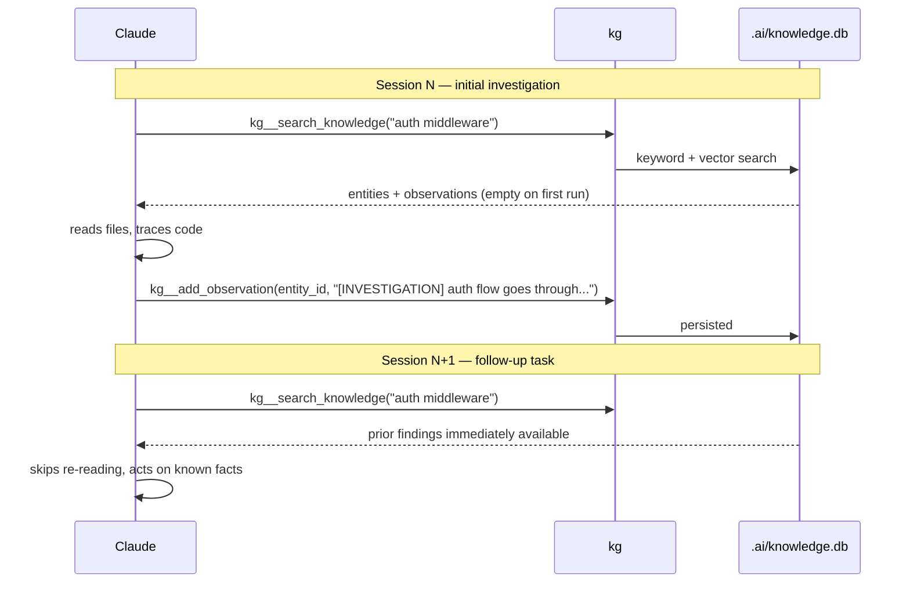
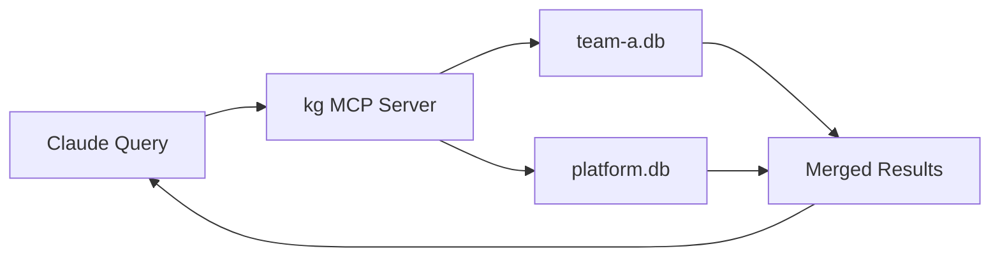
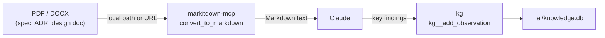

# Knowledge Graph — Claude Integration Guide

The `kg` server gives Claude a persistent, project-scoped memory that survives
across sessions. Used well, it eliminates most of the re-discovery work that happens
at the start of every investigation: re-reading files, re-tracing call chains,
re-establishing "where is X". This document covers how to configure Claude to use
the KG effectively, and the patterns that yield the most value.

---

## How it Works



The KG is a force-multiplier on repeated work in the same codebase. The first agent
to investigate a component pays the full exploration cost. Every subsequent agent
starts from those findings.

### Multi-Scope KGs (Monorepos)

For large monorepos, kg supports **scoped knowledge graphs** where platform/shared code
and team-specific domains maintain separate databases with automatic federation:



See [kg-scopes.md](kg-scopes.md) for configuration details. When a default scope is set,
the MCP server automatically queries both the team's database and any platform layers,
returning unified results with team-specific knowledge taking precedence.

---

## CLAUDE.md Configuration

### Minimal — read-only

Paste this into your project's `CLAUDE.md` to give Claude read access to the KG.
This alone reduces re-exploration significantly.

```markdown
## Knowledge Graph

A knowledge graph for this project is available via the `kg` MCP server.

**Search before you explore.** Before grepping or reading files, search the KG:
- `kg__search_knowledge({query: "..."})` — find entities, components, prior findings
- `kg__get_file_context({file: "path/to/file"})` — see what's in a file before reading it
- `kg__query_graph({cypher: "..."})` — trace dependencies and call chains

If the KG has an answer, use it directly. Only fall back to file search if the KG
returns nothing useful.
```

### Full — read + write

Add write instructions to record findings for future sessions:

```markdown
## Knowledge Graph

A knowledge graph for this project is available via the `kg` MCP server.

### Before exploring code
Search the KG first — it may already contain the answer:
- `kg__search_knowledge({query: "..."})` — entities, observations, prior findings
- `kg__get_file_context({file: "..."})` — file-level entity summary
- `kg__query_graph({cypher: "..."})` — Cypher for precise dependency traversal

### While working
Record findings incrementally — do not wait until the task is complete:
- `kg__add_observation({entity_id, content: "[INVESTIGATION] ..."})` — root causes,
  design decisions, caveats, hypotheses ruled out
- `kg__add_entity({name, type})` — new functions, types, or topics discovered
- `kg__link_entities({from_id, relation, to_id})` — dependency or call relationships

**Write after every significant finding**, not just at the end. If a task times out
or is interrupted, observations already written are preserved and recoverable.

### Observation format
Prefix observations by category so future searches are faster:
- `[INVESTIGATION]` — findings from debugging or exploration
- `[DECISION]` — architectural or design choices and their rationale
- `[CAVEAT]` — known limitations, edge cases, or gotchas
- `[PERFORMANCE]` — measured characteristics or bottlenecks
```

---

## High-Value Use Cases

### 1. Preflight Context — Start Every Task with a KG Check

Before beginning any substantial task, load relevant prior context:

```
kg__search_knowledge({query: "<task topic>", limit: 10})
kg__search_knowledge({query: "<key component names>"})
```

**Why it matters:** A 2-second search can surface hours of prior investigation.
A finding recorded as `[INVESTIGATION] the deadlock in TaskQueue.Enqueue occurs
when the mutex is held during the SSE flush` is immediately actionable — no repro,
no bisect, no file reading required.

**CLAUDE.md instruction:**
```markdown
At the start of every task, before reading any files:
1. Call `kg__search_knowledge` with the task description and key component names.
2. If relevant observations exist, read them before opening any files.
3. Only proceed to file exploration for facts not already in the KG.
```

---

### 2. Architecture Understanding — Replace File Reading with Graph Traversal

Understanding how components relate is expensive when done via file reading.
The KG makes it a single query:

```cypher
-- What does this module depend on?
MATCH (m:module {name: "auth"})-[:DEPENDS_ON]->(dep) RETURN dep.name, dep.type

-- What calls this function?
MATCH (caller)-[:CALLS]->(f:function {name: "validateToken"}) RETURN caller.name

-- What does this file export?
MATCH (f:file {name: "internal/auth/middleware.go"})-[:CONTAINS]->(e) RETURN e.name, e.type
```

**CLAUDE.md instruction:**
```markdown
To understand component relationships, prefer `kg__query_graph` over reading
multiple files. Use `kg__get_file_context` to get a summary of a file's entities
before deciding whether to read the full file.
```

---

### 3. Investigation Checkpointing — Never Lose Progress

Long investigations are expensive to restart. The KG acts as a checkpoint log:

```markdown
## Observations written during investigation

- [INVESTIGATION] Auth failure path: token expiry check happens in validateToken()
  before the permission check, so expired tokens never reach the permission layer.
- [INVESTIGATION] The retry loop in client.go:247 has no jitter — under load this
  causes thundering herd. Not the current bug but worth a follow-up.
- [INVESTIGATION] RULED OUT: the issue is not in the database layer — confirmed
  by adding logging to Store.Get(); it returns correctly.
```

When the next session picks up, `kg__search_knowledge("auth failure")` immediately
surfaces these findings. The re-investigation cost is near zero.

**CLAUDE.md instruction:**
```markdown
During any investigation or debugging task:
- After confirming a root cause (or ruling one out), immediately write an observation.
- Prefix with [INVESTIGATION] and include what was found AND what was eliminated.
- Do not defer writes to the end of the task — write as you go.
```

---

### 4. Decision Log — Capture the "Why" Alongside the Code

Code captures *what* was built. The KG captures *why*:

```
kg__add_entity({name: "auth-session-design", type: "topic"})
kg__add_observation({entity_id: "<id>", content:
  "[DECISION] Chose JWT over session cookies because the mobile client cannot
   share cookies across subdomains. Evaluated: JWT, opaque tokens, session cookies.
   Rejected opaque tokens due to Redis dependency. See ADR-004."})
```

Future Claude sessions (and engineers) asking "why are we using JWTs?" get the
answer from a search, not from hunting through git history or Slack.

**CLAUDE.md instruction:**
```markdown
When implementing or reviewing a non-obvious design choice:
- Add a [DECISION] observation explaining what was chosen, what was considered,
  and why alternatives were rejected.
- Link to any ADR or issue if one exists.
```

---

### 5. Cross-Session Refactoring — Track Partial Work

Large refactors span multiple sessions. The KG tracks progress:

```
[INVESTIGATION] Refactor status as of 2026-04-15:
- ✅ Migrated: internal/auth, internal/session
- 🔄 In progress: internal/middleware (half done, stopped at line 340)
- ⏳ Pending: cmd/server, integration tests
- CAVEAT: The old SessionStore interface must remain until cmd/server is migrated
  or the build breaks.
```

**CLAUDE.md instruction:**
```markdown
For multi-session refactoring tasks:
- At the end of each session, write an observation summarizing progress:
  which files are done, which are in progress (with line numbers if helpful),
  which are pending, and any blockers or caveats for the next session.
```

---

### 6. Codebase Onboarding — Index First, Ask Second

Before starting work on an unfamiliar codebase, index it:

```bash
kg index   # or: kg__index_project from within Claude
```

Then use the KG for orientation before reading any files:

```
kg__search_knowledge({query: "entry point main server"})
kg__search_knowledge({query: "database storage layer"})
kg__query_graph({cypher: "MATCH (f:file) RETURN f.name ORDER BY f.name LIMIT 50"})
```

**CLAUDE.md instruction:**
```markdown
For new contributors or when starting work in an unfamiliar area:
1. Run `kg index` from the project root to index the codebase.
2. Use `kg__search_knowledge` to orient before reading files.
3. Use `kg__get_file_context` to preview a file's contents without opening it.
```

---

### 7. Test Failure Triage — Check KG Before Bisecting

When a test fails, the KG may already know why:

```
kg__search_knowledge({query: "TestAuthFlow failure flaky"})
kg__search_knowledge({query: "auth session timeout"})
```

If a prior investigation recorded `[CAVEAT] TestAuthFlow is timing-sensitive —
flakes under load because the token expiry window is only 50ms`, that's immediately
actionable. No bisect required.

**CLAUDE.md instruction:**
```markdown
When a test fails:
1. Search the KG for the test name and the components it exercises.
2. Check for [CAVEAT] or [INVESTIGATION] observations on those components.
3. Only proceed to log analysis and bisecting if the KG has nothing relevant.
```

---

## Cypher Reference for Common Queries

```cypher
-- Find all functions in a package
MATCH (p:package {name: "auth"})-[:CONTAINS]->(f:function) RETURN f.name

-- Find recent observations (requires timestamp support)
MATCH (e)-[:HAS_OBSERVATION]->(o:observation)
WHERE o.content STARTS WITH "[INVESTIGATION]"
RETURN e.name, o.content LIMIT 20

-- Find all callers of a function
MATCH (caller)-[:CALLS]->(f:function {name: "parseToken"})
RETURN caller.name, caller.type

-- Find everything a file imports
MATCH (f:file {name: "cmd/server/main.go"})-[:IMPORTS]->(dep)
RETURN dep.name

-- Find orphaned entities (nothing links to them)
MATCH (e) WHERE NOT ()-[:CONTAINS|CALLS|IMPORTS|DEPENDS_ON]->(e)
RETURN e.name, e.type LIMIT 20
```

---

## markitdown + kg Together

The two MCPs complement each other for research-heavy tasks:



**Pattern:** Use `markitdown` to read a spec or design doc, extract the key decisions
and constraints, then write them as KG observations on the relevant entities. Future
sessions can search for those constraints without re-reading the document.

**CLAUDE.md instruction:**
```markdown
When reading a specification, design document, or ADR:
1. Use `convert_to_markdown` to get the document content.
2. Extract key decisions, constraints, and entity names.
3. Write each as a [DECISION] or [CAVEAT] observation on the relevant KG entity.
   This makes the document's constraints searchable without re-reading it.
```
