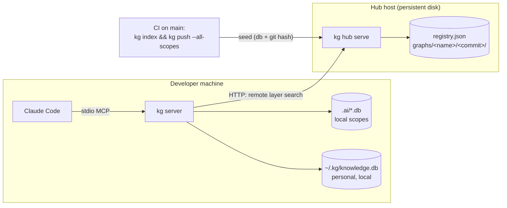

# KG Shared Service — Design Proposal

**Status:** implemented through phase 4 · per-user auth built behind the pluggable
verifier (`token`, `oidc`, `github`; `proxy` outstanding) · **Date:** 2026-08-20 ·
**Last verified:** 2026-08-29

Retained as the design record, not as a statement of pending work. See
[Rollout phases](#rollout-phases) for what shipped and what is still open, and
[kg-shared-service.md](kg-shared-service.md) for how to run and use the hub.

A shared knowledge repository for teams: an opt-in network service (the **hub**) that
hosts read-only knowledge graphs for a set of repositories and answers search queries in
place. Every developer's `kg` federates the hub's graphs into local search — alongside
their local project graphs and their local personal store.

The hub is a **live query service**, not blob distribution: graphs live and are queried
on the hub; clients never download database files. It ships as a subcommand of the
existing binary (`kg hub serve`) and needs one persistent Linux host — hosting options
are covered [below](#hosting).

## Problem

Every graph today is a local Kuzu file. That has three consequences for a team:

1. **No shared knowledge.** Each developer indexes their own copy of each repo, and
   hand-written observations (decisions, caveats, `add_observation`) never leave the
   machine that wrote them.
2. **Redundant indexing.** Ten developers each pay the full index cost of the same
   monorepo, on every machine.
3. **No provenance.** A graph does not record which commit it reflects, so there is no
   way to know a graph is stale, or to reindex incrementally.

## Goals

- **Shared service option.** `kg` remains local-first; the hub is opt-in. A team runs
  one hub, seeds it with the repos they care about, and every client's search federates
  it.
- **Seeding.** A repeatable way to (re)populate each repo's graph in the hub — including
  seeding directly from an **existing federated local system**: a monorepo's
  already-built scope databases push up as-is, no re-index required.
- **Git hash per repo.** The hub records the commit each graph was indexed at; clients
  compare it against their checkout, and reseeding can eventually be incremental.
- **Personal store stays local.** The personal KG (`~/.kg/knowledge.db`) continues to
  federate as a local database layer, exactly as today. It never leaves the machine and
  is never hosted on the hub.

## Non-goals (v1)

- **Shared writes.** Hub graphs are read-only to clients. Writes (`add_entity`,
  `add_observation`) keep landing in the local project graph. Team-shared observations
  reach the hub by being present in a scope's database at push time.
- **Per-user access control in v1.** Shipped as one bearer token for reads (optional on
  a trusted network) and one for seeding. This is a v1 expedient, not the destination —
  a single shared secret cannot be revoked per person, cannot say who pushed what, and
  has to be redistributed to every client to rotate. Per-user identity is the agreed
  direction; see [Authentication](#authentication).
- **Real-time sync.** The hub reflects the last seed, not the working tree.
- **Snapshot download to clients.** Considered and rejected as the primary model — it
  turns the hub into blob storage, couples every client to the hub's Kuzu storage
  format, and re-ships large files on every reseed. (An offline read cache could be
  added later; the hub's storage layout wouldn't change.)

## Architecture



Clients federate hub graphs as **remote layers**: HTTP clients that satisfy the same
interface local layers do, merged by the existing `FederatedStore` with unchanged
semantics. A hub that is unreachable degrades exactly like a broken local layer today —
warning on stderr, search proceeds with the remaining layers.

## Components

### 1. `kglib`: layer abstraction

`FederatedStore` currently merges over `[]LayerConfig{Name, Store *kglib.Store,
Priority, ProjectID}` and calls `layer.store.HybridSearch(...)` directly
(`kglib/federated.go`). Introduce an interface at the layer boundary:

```go
// SearchLayer is anything that can answer a federated search: a local Kuzu
// store, or an HTTP client for a hub-hosted graph.
type SearchLayer interface {
    HybridSearch(projectID, query string, queryEmbedding []float32, cfg SearchConfig) ([]*SearchResult, error)
    Close() error
}
```

`*Store` already satisfies it; `LayerConfig.Store` changes type to `SearchLayer`. Merge
semantics (priority override, equal-priority score summing, failed-layer skip) are
untouched — a behavior-neutral refactor, useful on its own.

`RemoteLayer` is the second implementation: it POSTs the query to the hub and decodes
`[]*SearchResult`. Only search federates (as today — `query_graph` and
`get_file_context` stay primary-scope-only), so the interface stays this small.

### 2. The hub: `kg hub serve`

```bash
kg hub serve --listen :7411 --data /var/lib/kg-hub
```

**Storage layout** (`--data` dir, default `$KG_HUB_HOME` or `~/.kg-hub`):

```
registry.json                     # graph → repo URL, commit, indexedAt, kgVersion, projectID, layers
graphs/
  platform/
    a1b2c3d.../knowledge.db       # sealed snapshot, one dir per seeded commit
    current -> a1b2c3d...         # symlink, swapped atomically on seed
  team-a/
    ...
```

Reads open `current` read-only (multiple readers are fine — the same open-use-close
discipline the stdio server uses). A seed writes a new commit dir, fsyncs, then renames
the symlink; in-flight reads finish against the old snapshot. Keep the last N snapshots
(default 2), prune older.

**Registry entry:**

```json
{
  "graphs": {
    "platform": {
      "repo": "git@github.com:org/monorepo.git",
      "commit": "a1b2c3d4...",
      "indexedAt": "2026-08-20T14:00:00Z",
      "kgVersion": "1.4.0",
      "projectID": "monorepo",
      "layers": []
    },
    "team-a": { "...": "...", "layers": ["platform"] }
  }
}
```

`layers` records the federation topology of the source system, so a client subscribing
to `team-a` knows to also federate `platform` — this is what makes seeding from an
existing federated monorepo round-trip cleanly.

**HTTP API (v1, JSON):**

| Endpoint | Purpose |
|----------|---------|
| `GET /v1/graphs` | List graphs with registry metadata |
| `GET /v1/graphs/{name}` | One graph's metadata |
| `POST /v1/graphs/{name}/search` | `{query, limit}` → search results (hub runs `HybridSearch` on the graph, using the graph's own `projectID`) |
| `POST /v1/search` | `{query, limit, graphs?}` → fan-out across graphs server-side, one round trip for clients federating many graphs |
| `PUT /v1/graphs/{name}` | Seed: tar.zst of the `.db` dir + metadata `{repo, commit, kgVersion, layers}` |
| `GET /healthz` | Liveness |

**Auth (today):** two bearer tokens via env — `KG_HUB_READ_TOKEN` (optional; empty means
open reads on a trusted network) and `KG_HUB_SEED_TOKEN` (required for PUT), compared
constant-time in `hub.tokenMatches`. TLS is a reverse proxy's job, not kg's. See
[Authentication](#authentication) for where this is going and why.

**Version coupling:** only the seeder and the hub must run compatible kg/Kuzu versions
(the hub opens the uploaded files); clients just speak HTTP. The seed request carries
the seeder's kg version and the hub rejects an incompatible one with a clear error
rather than failing at open time.

### 3. Seeding

#### From an existing federated local system

The common starting point: a monorepo already running scopes (`platform.db`,
`team-a.db`, layered per [kg-scopes.md](kg-scopes.md)). Those databases are already
built — seeding must not require a re-index.

```bash
kg push --hub https://kg.internal:7411 --all-scopes    # every scope of this project
kg push --hub https://kg.internal:7411 --scope platform
```

`kg push`:

1. Resolves scope databases exactly as every other command does.
2. Reads each database's `KGMeta` stamp (commit, repo, embedder — below) for the git
   hash. **Pre-existing databases won't have a stamp**: push falls back to the
   checkout's current `HEAD`, warns the hash is approximate, and suggests a re-index to
   make it exact (`--commit <sha>` overrides).
3. Refuses a dirty working tree when deriving the hash from `HEAD`, unless
   `--allow-dirty`.
4. Archives each `.db` directory (tar.zst) and PUTs it with metadata, including the
   scope's `layers` so the topology lands in the registry.

Graph names default to scope names; `--graph <name>` renames on push for
single-database (legacy `knowledge.db`) projects.

#### Ongoing, from CI

```bash
# on merge to main
kg index --all && kg push --hub https://kg.internal:7411 --all-scopes
```

Push-from-CI beats hub-side clone+index: the hub needs no git credentials and no
language toolchains, and indexing runs where the checkout already exists. Freshly
indexed databases carry an exact `KGMeta` stamp, so CI pushes are always precisely
labeled.

#### The git hash, in two places

- **In the registry** — the hub's answer to "what commit is this graph at."
- **In the graph itself** — `kg index` gains a `KGMeta` entry (repo URL, commit,
  indexedAt, embedder model) stamped into every database it builds. Snapshots
  self-describe even outside the hub, local graphs become staleness-checkable with no
  hub at all, and push reads the hash from here rather than guessing.

**Staleness check**, implemented with local git only (`git merge-base`,
`git rev-list --count`) — the hub never runs git:

```bash
kg hub status
# platform  hub: a1b2c3d (2026-08-19)  local HEAD: f00dfeed  → hub is 4 commits behind
```

**Incremental reseed (later):** with the indexed hash recorded,
`kg push --incremental` can `git diff --name-only <indexed-commit>..HEAD`, reindex only
changed files into a copy of the previous snapshot, and push that. v1 pushes are whole
databases.

### 4. Client federation

`.ai/config.json` names the hub once; scopes list which hub graphs to federate:

```json
// .ai/config.json
{ "defaultScope": "team-a", "hub": "https://kg.internal:7411" }

// .ai/scope/team-a.json
{
  "name": "team-a",
  "database": "team-a.db",
  "layers": ["platform"],
  "remotes": ["api-contracts", "design-system"]
}
```

Layer priorities, lowest to highest:

| Priority | Layer | Backing |
|----------|-------|---------|
| 0 | personal store (`--with-personal`) | local `~/.kg/knowledge.db` — unchanged |
| 1..R | `remotes` (hub graphs) | `RemoteLayer` over HTTP |
| R+1.. | local `layers` (scopes) | local read-only Kuzu |
| top | the scope's own database | local read-write Kuzu |

Local knowledge outranks hub knowledge on duplicate entities: your fresh local index of
a repo beats the hub's last seed of it. Each remote layer carries the `ProjectID`
override from the registry — the same mechanism `--with-personal` uses; without it,
cross-store search silently returns nothing from that layer. If a remote graph's
registry entry names `layers`, those hub graphs federate in beneath it automatically.

When a scope lists more than a couple of remotes, the client uses the hub's fan-out
endpoint (`POST /v1/search`) so N remote layers cost one round trip; the response is
grouped per graph and feeds the same merge.

**MCP surface: unchanged.** `search_knowledge` and `get_preflight_context` federate
whatever the active scope defines, which now may include remote layers. Agents don't
know or care that a layer is remote.

### 5. Embeddings

All current search entry points call `HybridSearch` with a nil query embedding (keyword
scoring drives the hybrid), so v1 remote search sends query text and the hub searches
exactly as a local layer would. When query embeddings become load-bearing, they must be
computed **hub-side** with the same embedder each graph was indexed with (recorded in
its `KGMeta` stamp) — a client-computed vector from a different model or dimension is
garbage against the hub's index. Hub-side embedding (e.g. an Ollama sidecar) is
additive later work.

## Hosting

The hub is one Go binary plus a data directory. Any persistent Linux host works; it is
single-node by design (Kuzu is embedded — no clustering to configure, and read-only
opens handle concurrent queries). GitHub cannot host it — GitHub runs no long-lived
services and offers only blob/artifact storage, which is the model this design rejects.

**Decided for cortexa.com: a self-hosted Ubuntu Linux server in existing infra.** That
is the established pattern there — Ubuntu LTS hosts are domain-joined via `realmd` +
`sssd`, and the estate already self-hosts comparable services (Infisical, ReportPortal).
The options below remain for anyone deploying kg elsewhere.

| Option | Effort | Notes |
|--------|--------|-------|
| **Existing internal infra** (k8s, Nomad, a VM you already run) | — | StatefulSet/unit + persistent volume. If the team has this, use it. **This is the cortexa.com choice.** |
| **Small VPS + Tailscale** (Hetzner ~€4/mo, DigitalOcean, Lightsail) | low | `scp` the binary, a systemd unit, disk is just there. Tailscale/tailnet ACLs double as network auth and TLS, so `KG_HUB_READ_TOKEN` can stay off. Recommended absent existing infra. |
| **Fly.io + volume** | low | Container + `fly volumes create`; private access over WireGuard (Flycast) keeps it off the public internet. A few $/mo. |
| **Railway / Render persistent disk** | low | Git-push deploy; public URL, so read token + TLS required. |
| **Spare office box + Tailscale** | trivial | Fine for small teams; mind backups. |

Notes that apply everywhere:

- **CGO:** kg links Kuzu via CGO — deploy the binary built for the host's
  platform/libc, or ship the container image (a `Dockerfile` for `kg hub serve` is part
  of Phase 2).
- **Disk sizing:** sum of graph databases × N retained snapshots (default 2), plus
  headroom for an in-flight upload.
- **Disaster recovery is cheap:** every graph is reproducible by re-running
  `kg push` from CI. Backing up `registry.json` alone is enough to know what to
  re-seed; back up the full data dir only if re-indexing large repos is expensive
  enough to matter.

## Authentication

**Decision: per-user identity via OIDC, behind a pluggable verifier. Mostly built:
the verifier interface and the `oidc`, `github` and `token` verifiers are implemented
(`internal/hub/auth.go`, `oidc.go`, `github.go`); `proxy` remains.** Scheme selection is
per surface (`KG_HUB_READ_AUTH` / `KG_HUB_SEED_AUTH`, default `token`), so OIDC reads
can roll out while CI keeps the seed token. In oidc mode, seeding is restricted to
`KG_HUB_SEED_SUBJECTS` (subjects or emails) when set, and every accepted seed logs the
pusher's identity.

### Why the shared token has to go

`KG_HUB_READ_TOKEN` is one secret held by everyone who can search. It cannot be revoked
for one person, it makes the audit log say "someone", and rotating it means editing every
client's scope config at once. A secret that everybody holds is not defence in depth; it
is a single point of compromise with extra distribution steps. The same applies to
`KG_HUB_SEED_TOKEN`, which additionally lives in CI.

### OIDC as the mechanism

Entra ID, Okta, Keycloak, Auth0 and Google are genuinely interchangeable over OIDC. The
hub is configured with an **issuer URL**; it fetches that issuer's discovery document
(`/.well-known/openid-configuration`), takes `jwks_uri` from it, validates the JWT
signature against the published keys, and checks `iss`, `aud` and `exp`. `sub` becomes
the identity for authorization and audit. Changing provider is configuration, not code.

The transport already fits: the hub reads `Authorization: Bearer`, which is what OIDC
access tokens use. Only the validation step and what falls out of it change.

**GitHub is the exception, and it is one cortexa.com already uses** (ReportPortal
authenticates against a GitHub OAuth app in the Cortexa-LLC org). GitHub's user sign-in
is OAuth 2.0 without OIDC — no ID token, no discovery document, no JWKS. Identity comes
from calling `GET /user` and `GET /user/orgs` with an opaque token. (GitHub's OIDC
tokens exist only for Actions workload identity and identify a workflow, not a person.)
A generic OIDC verifier therefore cannot reach it.

### The plugin model

Rather than pick one provider, the hub gets a small verifier interface — roughly
`Verify(*http.Request) (Identity, error)`, where `Identity` carries at least a stable
subject and optionally groups. Implementations:

| Verifier | Covers | Status |
|----------|--------|--------|
| `oidc` | Entra ID, Okta, Keycloak, Auth0, Google — anything with a discovery document | built |
| `github` | GitHub OAuth, with org or team membership as the access check | built |
| `proxy` | A trusted identity-aware proxy (oauth2-proxy, Pomerium, Authelia) that has already authenticated the request and passes a verified header | pending |
| `token` | The current shared token, as a degenerate single identity — keeps existing deployments working and gives the interface a trivial reference implementation | built |

This keeps GitHub reachable without a broker, and keeps the door open to one. An
identity broker (Keycloak or Authentik with Entra, Okta and GitHub configured upstream)
remains the option that scales furthest — the hub would speak `oidc` to the broker and
nothing else, forever, and adding a provider becomes broker configuration rather than a
kg release. The plugin model does not preclude that; it makes the broker one deployment
choice rather than a prerequisite.

The `proxy` verifier carries an obvious hazard: a trusted header is forgeable by anyone
who can reach the port directly. A hub configured for it must bind loopback only, and
should refuse to start bound to anything else.

### CLI clients

`kg search` has no browser redirect to catch a callback, so the interactive flow is the
**OAuth 2.0 Device Authorization Grant** (RFC 8628) — the "open this URL, enter this
code" pattern. Entra, Okta, Keycloak and Auth0 support it; GitHub has it as a toggle on
OAuth apps. CI pushes are non-interactive and want client credentials or a workload
identity instead, which is a separate grant against the same issuer.

### Secrets

`KG_HUB_READ_TOKEN` and `KG_HUB_SEED_TOKEN` are credentials, and cortexa.com's rule is
that credentials live in Infisical (self-hosted at `infisical.cortexa.com`) while
non-sensitive config does not. They are currently plain env vars, and the read token is
additionally copied into every client's scope config. Moving them is worth doing
independently of any OIDC work, and settles where CI gets the seed token for `kg push`.

### Sequencing

Authorization granularity — whether an authenticated user reads every graph or only
some — is deliberately left open. It depends on what the hub ends up holding, and the
registry already records which repo owns each graph, so per-graph rules can be added
without a schema change. `Identity` carries `Groups` from the start, so that decision
stays cheap.

This sequencing is now largely built: `Identity` is threaded through the request path
and the `Verifier` interface admits `token` (the shared token as the degenerate
implementation), `oidc`, and `github` — `proxy` remains. Doing it in that order made real
SSO an additive change rather than a rearchitecture, which is the only thing "SSO-ready"
can honestly mean. Authorization granularity is still open.

## Migrating existing databases

Three distinct migration concerns, with different answers:

- **Additive schema changes (handled).** Every read-write open runs `initSchema`,
  which is re-runnable by construction: `CREATE ... IF NOT EXISTS` for tables (this is
  how `KGMeta` arrives on old databases) and `ALTER TABLE ADD` with "already has
  property" suppressed for new columns (how the embedding columns arrived). An existing
  database migrates on its next `kg index` or write; read paths tolerate not-yet-migrated
  schema (`GetMeta` reports "no stamp" rather than erroring on a pre-KGMeta database).
- **Provenance backfill (handled).** Pre-existing databases gain their stamp on the next
  `kg index`; until then `kg push` falls back to current HEAD with a warning. The stamp's
  `KGVersion` field means every database self-reports which kg wrote it.
- **Kuzu storage-format upgrades (built — Phase 4).** go-kuzu
  pins the storage engine; a future bump can make old `.db` files unopenable. Users who
  have adopted kg must never face manual breakage, so the mechanism is zero-action
  migration, split by data kind:

  0. **Detecting a format change — a sidecar version stamp, not the open error.**
     The original plan here was to react to "a format-mismatch open error". No such
     error is observable: go-kuzu's `OpenDatabase` discards the engine's diagnostic
     and returns only `failed to open database with status %d`, so a format mismatch,
     a held lock, a missing file, and a corrupt database are indistinguishable. (This
     is also why opening a nonexistent database used to report it as locked by another
     process.) The C API exposes `kuzu_get_storage_version()`; go-kuzu ships no binding
     for it.

     Detection therefore happens *before* the open, against a sidecar
     `<db>.format.json` recording the pinned go-kuzu module version, read at runtime
     with `debug.ReadBuildInfo()`. The stamp lives outside the database because its
     whole job is to be readable when the database is not. Written on every
     write-mode open, which proves by construction that the running engine can read
     the format. Databases predating the stamp report `FormatUnstamped` and are
     deliberately left alone — rebuilding every pre-existing graph on sight would be
     the forced breakage this exists to prevent; that generation is what the retained
     binary below covers.

  1. **Indexed data — auto-rebuild.** Project graphs are derivable from source. On a
     detected mismatch the new binary moves the database aside
     (`knowledge.db.old-<version>`) and re-indexes automatically; the user sees a
     slower first run, not an error. The `KGMeta` stamp tells the new binary what the
     old graph reflected.

     **Ordering, which is load-bearing:** `Indexer.Index` opens by calling
     `clearProjectData`, which deletes every row carrying the project ID — hand-written
     ones included, since they share it. Journal replay must therefore run *after*
     indexing. Replaying first puts the journal's contents exactly where the clear step
     is about to erase them.

     This also repairs a pre-existing data-loss bug: before Phase 4, `kg add entity`
     followed by `kg index` silently destroyed the entity. `kg index` now replays the
     journal on every run, not only after a migration.
  2. **Hand-written knowledge — a logical write journal.** Every hand-write (`kg add
     entity/observation/link`, the MCP `add_entity` / `add_observation` /
     `link_entities` tools, and all personal-store writes) also appends one JSON line
     to `<db>.journal.jsonl` beside the database. The journal is
     engine-format-independent; after an engine bump, the new binary replays it into
     the fresh database — no old binary needed, ever. Writes of this kind are rare and
     small, so the dual-write cost is negligible. Replay caveat: entity UUIDs are
     regenerated on re-index, so journal entries must identify entities by
     `(name, type, project)` and re-resolve at replay, not by raw UUID. Compaction
     (rewriting the journal as a current-state dump) rides along with `kg export`.
  3. **Transition-generation safety net.** Databases created before journaling shipped
     have nothing to replay. For that one boundary, installing retains the outgoing
     binary beside the new one as `<install-dir>/kg.old-<version>` — usually
     `/usr/local/bin` — so it stays on `PATH` and can simply be run. Capped at the two
     most recent, since they are ~45 MB each.

     Retention lives in `install.py`, and `make install` shells out to it
     (`--retain-only`) rather than carrying a second copy, because the two install
     paths drifting is exactly how a safety net stops being one. It is best-effort:
     a directory the installer cannot write warns rather than blocking the upgrade.

     The `.old-` marker is not decoration. Pruning globs `kg.old-*` in a shared
     directory and deletes what it matches; a looser pattern like `kg-*` could take
     an unrelated command with it.

     Vestigial once journaling has shipped everywhere.

  The hub migrates itself: CI re-pushes after upgrading, the seed version gate keeps
  mixed-format snapshots out, and the registry's `kgVersion` names any graph still
  awaiting re-push.

  **Ordering constraint:** journaling must ship while the current Kuzu version is
  still current — before any format-breaking bump — so every adopter's store has a
  journal by the time one arrives. This promotes journaling ahead of "later" in the
  phase plan.

## Rollout phases

1. **Foundations (no hub, behavior-neutral):** `SearchLayer` interface in `kglib`;
   `KGMeta` commit/repo/embedder stamping in `kg index`; `kg meta` to print it.
   Valuable standalone — every local graph becomes staleness-checkable.
2. **Hub:** `kg hub serve` (registry, storage layout, search + list + fan-out
   endpoints, tokens, Dockerfile) and `kg push` (including `--all-scopes`, layer
   topology, and the no-stamp/HEAD fallback for pre-existing federated databases).
   Integration test: seed two layered graphs from a scope config, search over HTTP.
3. **Client:** `RemoteLayer`, `remotes` in scope config, `kg hub status`. User-facing
   doc (`kg-shared-service.md`) + cross-links from kg-scopes.md and README.
4. **Durability (shipped):** the hand-write journal + format-mismatch
   auto-rebuild/replay, `kg export`/`kg import` (JSONL round-trip; doubles as journal
   compaction and personal-store backup), `kg migrate`, and installer retention of the
   outgoing binary — see "Migrating existing databases".
5. **Later:** per-user authentication (OIDC behind a pluggable verifier — see
   [Authentication](#authentication); interface plus `oidc`/`github`/`token`
   verifiers are built, `proxy` remains); incremental reseed; hub-side query embedding;
   `Source` field on `SearchResult` for provenance display; offline read cache if a team
   wants search on planes.

   "Per-graph tokens" used to sit on this list; it is superseded. More shared secrets is
   the wrong shape for the problem, which is per-user authorization.

## Open questions

- ~~**Where does this team's hub actually live?**~~ **Answered:** a self-hosted Ubuntu
  server in cortexa.com's own infra. Read auth is not settled by that, because the
  answer turned out not to be "token or network" — see [Authentication](#authentication)
  for the per-user direction that replaced the question.
- **Scale expectations:** how many repos, how large, how many clients? Affects whether
  the fan-out endpoint is worth building, and whether remote-layer search needs to stop
  being sequential (currently one 3s timeout per layer, in series).
- ~~**Naming:**~~ **Answered:** graph names are `<repo>` for a repo's default scope (or
  a repo with no scopes) and `<repo>.<scope>` otherwise, with `<repo>` taken from the git
  remote. Repo names are unique within a GitHub org by construction, and a hub serves one
  org, so no owner segment is needed. The default scope keeps the bare name so a
  single-project meta-repo stays `depop` and adding a second scope later does not rename
  the first one's graph.

  Separator is `.`, not the `/` this question originally proposed: graph names become
  single filesystem path components on the hub, and `graphNameRE` rejects `/` — that
  hardening (6a20b7d) postdates the question.

  Overridable per-push with `--graph` and per-scope with `hubGraph` in the scope config.
  Independently, the hub now refuses a push to a graph another repo seeded (`X-KG-Force`
  overrides), so a bad override fails loudly rather than replacing someone's knowledge.
- **Deployment artifact:** systemd unit with a natively-built binary, or the Phase 2
  container image? The native path needs the CGO/Kuzu binary built against the host's
  glibc; the container sidesteps that. No systemd unit exists yet either way.

## See also

- [kg-scopes.md](kg-scopes.md) — the local federation model this extends
- [kg-personal-store.md](kg-personal-store.md) — the personal store, which stays local by design
- [../src/kglib/README.md](../src/kglib/README.md) — `FederatedStore` merge semantics
