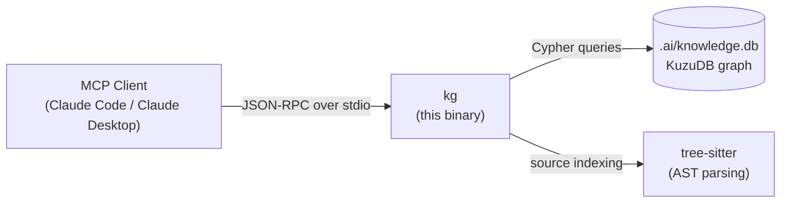

# kg MCP

A [Model Context Protocol](https://modelcontextprotocol.io) server that provides a
persistent, project-scoped knowledge graph backed by [KuzuDB](https://kuzudb.com).
Agents use it to store and retrieve code entities, architectural observations, and
investigation findings across sessions.

## Architecture



Each project gets its own isolated graph at `.ai/knowledge.db`, auto-discovered by
walking up the directory tree to find a `.ai/` directory, git root, or common project
markers (`go.mod`, `package.json`, etc.).

---

## Prerequisites

- **Go 1.24+** — [install](https://go.dev/dl/) (CGO required — included in the standard Go toolchain)
- A C compiler (Xcode CLT on macOS: `xcode-select --install`; gcc/clang on Linux)

---

## Quick Install

```bash
# macOS / Linux — from the repo root
curl -fsSL https://raw.githubusercontent.com/Cortexa-LLC/mcp/main/install.py | python3 - --mcp kg

# From a clone
cd src/kg && make install
```

## Manual Build

```bash
cd src/kg
make build        # → ./kg
make install      # build + copy to /usr/local/bin/kg
```

---

## First-Time Setup: `kg index`

Before using the MCP tools, index your project to populate the graph:

```bash
cd your-project
kg index
```

```
🔍 Indexing codebase at /path/to/your-project...
✅ Indexing complete!
   Files scanned:     191
   Entities created:  1113
   Relations created: 1517
   Duration:          5.2s
```

This scans all source files, extracts functions, types, packages, and import
relationships, and stores them in `.ai/knowledge.db`. Re-run after large structural
changes or significant refactors.

**Skipped automatically:** `.git`, `node_modules`, `vendor`, `dist`, `build`, and
any path matching `.gitignore` or `.claudeignore` patterns.

---

## CLI Commands

`kg` is also a full command-line tool for direct graph operations:

```bash
# Index / populate
kg index                          # scan codebase → .ai/knowledge.db

# Explore
kg search "auth middleware"       # keyword search across entities + observations
kg stats                          # count of entities, relations, observations
kg show <entity-id>               # show one entity with its relations + observations

# Add knowledge manually
kg add entity --name "auth-design" --type "topic"
kg add observation <entity-id> "[DECISION] chose JWT because..."
kg link <from-id> --rel CALLS <to-id>

# Export / maintain
kg export                         # export graph to GraphML/JSON
kg graph > graph.graphml          # write GraphML to stdout
kg gc                             # remove orphaned nodes and observations

# MCP server (used by Claude — not normally run manually)
kg server --stdio

# Info
kg version
```

See [docs/kg-cli-reference.md](../../docs/kg-cli-reference.md) for the full reference,
including all flags, entity types, relation types, and Cypher query examples.

---

## MCP Tools

When connected as an MCP server, Claude has access to these tools:

| Tool | Description |
|------|-------------|
| `kg__search_knowledge` | Keyword + vector search across entities and observations |
| `kg__add_entity` | Add a code entity (function, class, file, topic, …) |
| `kg__add_observation` | Record a finding on an existing entity |
| `kg__link_entities` | Create a typed edge between two entities |
| `kg__query_graph` | Run a read-only Cypher query against the graph |
| `kg__get_file_context` | List all entities indexed from a file |
| `kg__get_preflight_context` | Summarise recent KG activity for agent preflight |
| `kg__index_project` | Re-index the project (same as `kg index`) |

---

## MCP Configuration

### Claude Desktop (`claude_desktop_config.json`)

```json
{
  "mcpServers": {
    "kg": {
      "command": "/usr/local/bin/kg",
      "args": ["server", "--stdio"]
    }
  }
}
```

Config file locations:
- **macOS**: `~/Library/Application Support/Claude/claude_desktop_config.json`
- **Linux**: `~/.config/Claude/claude_desktop_config.json`
- **Windows**: `%APPDATA%\Claude\claude_desktop_config.json`

### Claude Code (`.mcp.json` in project root) — Recommended

Place `.mcp.json` in each project root. Claude Code spawns `kg` with that directory
as the working directory, so `kg` opens the correct `.ai/knowledge.db` for that
project. Using a global config (`~/.claude/settings.json`) also works but relies on
Claude Code setting the right CWD — project-local is explicit and unambiguous.

```json
{
  "mcpServers": {
    "kg": {
      "command": "/usr/local/bin/kg",
      "args": ["server", "--stdio"]
    }
  }
}
```

Add `.mcp.json` to `.gitignore` if you prefer not to commit it, or commit it to
share the configuration with your team.

---

## CLAUDE.md Snippet

Add this to your project's `CLAUDE.md` to instruct Claude to use the KG:

```markdown
## Knowledge Graph

This project has a knowledge graph at `.ai/knowledge.db` (populated with `kg index`).

Before reading files or grepping, search the KG:
- `kg__search_knowledge` — find entities, prior findings, decisions
- `kg__get_file_context` — see what's in a file before opening it
- `kg__query_graph` — Cypher for dependency and call-chain traversal

While working, record findings so future sessions don't repeat the same exploration:
- `kg__add_observation` with `[INVESTIGATION]`, `[DECISION]`, or `[CAVEAT]` prefix
- Write after each significant finding, not just at the end
```

See [docs/kg-claude-integration.md](../../docs/kg-claude-integration.md) for
complete CLAUDE.md patterns and integration use cases.

---

## Environment Variables

| Variable | Default | Description |
|----------|---------|-------------|
| `OPENAI_API_KEY` | — | Enables OpenAI-backed vector embeddings for semantic search |
| `OLLAMA_HOST` | `http://localhost:11434` | Enables Ollama-backed embeddings (local) |

Embeddings are optional — keyword search works without them.

## Supported Languages (indexer)

Go, Python, TypeScript, JavaScript, Rust, Java, Kotlin, C, C++, C#, Swift, Ruby,
Bash, Groovy, CSS, HTML, YAML, Markdown, GraphQL, JSON Schema, PDF, Assembly, and Makefile.
