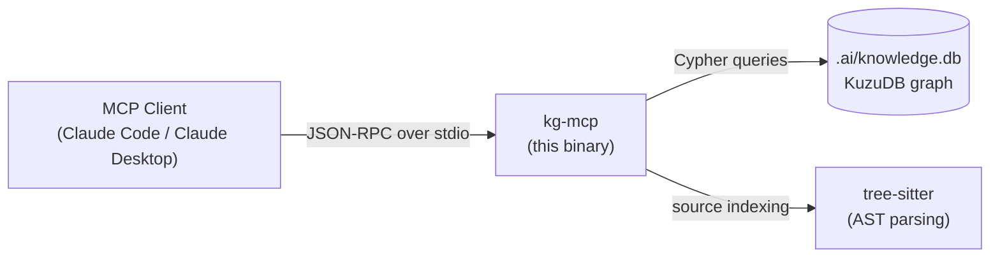

# kg MCP

A [Model Context Protocol](https://modelcontextprotocol.io) server that provides a
persistent, project-scoped knowledge graph backed by [KuzuDB](https://kuzudb.com).
Agents use it to store and retrieve code entities, architectural observations, and
investigation findings across sessions.

## Architecture



Each project gets its own isolated graph at `.ai/knowledge.db`, auto-discovered by
walking up the directory tree to find a `.ai/` directory, git root, or common project
markers (`go.mod`, `package.json`, etc.).

## Available Tools

| Tool | Description |
|------|-------------|
| `kg__search_knowledge` | Keyword search across entities and observations |
| `kg__add_entity` | Add a code entity (function, class, file, topic, …) |
| `kg__add_observation` | Record a finding on an existing entity |
| `kg__link_entities` | Create a typed edge between two entities |
| `kg__query_graph` | Run a raw Cypher query against the graph |
| `kg__get_file_context` | List all entities indexed from a file |
| `kg__get_preflight_context` | Summarise recent KG activity for agent preflight |
| `kg__index_project` | Index a project's source files into the graph |

## Prerequisites

- **Go 1.24+** — [install](https://go.dev/dl/) (CGO required — included in standard Go toolchain)
- A C compiler (Xcode CLT on macOS: `xcode-select --install`; gcc/clang on Linux)

## Quick Install

```bash
# macOS / Linux
curl -fsSL https://raw.githubusercontent.com/Cortexa-LLC/mcp/main/install.py | python3 - --mcp kg

# Or from a clone:
cd src/kg && make install
```

## Manual Build

```bash
cd src/kg
make build        # → ./kg-mcp
make install      # build + copy to /usr/local/bin/kg-mcp
```

## CLI Usage

`kg-mcp` is also a full CLI for direct graph operations:

```bash
kg-mcp index                     # Index current project into .ai/knowledge.db
kg-mcp search "auth middleware"  # Keyword search
kg-mcp add function parseToken   # Add an entity
kg-mcp stats                     # Graph statistics
kg-mcp handle-server --stdio     # Start MCP server (used by MCP clients)
```

## MCP Configuration

### Claude Desktop (`claude_desktop_config.json`)

```json
{
  "mcpServers": {
    "kg": {
      "command": "/usr/local/bin/kg-mcp",
      "args": ["handle-server", "--stdio"]
    }
  }
}
```

Config file locations:
- **macOS**: `~/Library/Application Support/Claude/claude_desktop_config.json`
- **Linux**: `~/.config/Claude/claude_desktop_config.json`
- **Windows**: `%APPDATA%\Claude\claude_desktop_config.json`

### Claude Code (`.mcp.json` in your project)

```json
{
  "mcpServers": {
    "kg": {
      "command": "/usr/local/bin/kg-mcp",
      "args": ["handle-server", "--stdio"]
    }
  }
}
```

## Environment Variables

| Variable | Default | Description |
|----------|---------|-------------|
| `OPENAI_API_KEY` | — | Enables OpenAI-backed vector embeddings for semantic search |
| `OLLAMA_HOST` | `http://localhost:11434` | Enables Ollama-backed embeddings (local) |

Embeddings are optional — keyword search works without them.

## Supported Languages (indexer)

Go, Python, TypeScript, JavaScript, Rust, C, C++, Java, Kotlin, C#, Ruby, Swift,
Groovy, Bash, CSS, HTML, YAML, Markdown, GraphQL, JSON Schema, PDF, and Makefile.
